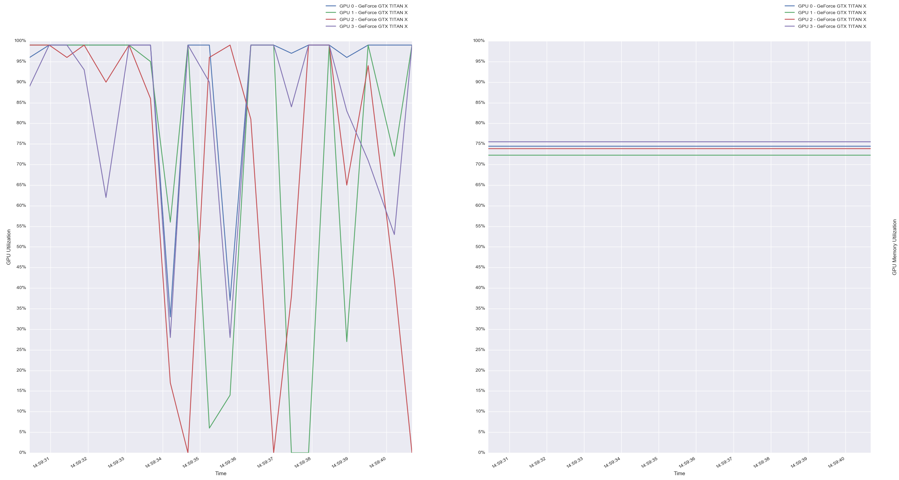

GPU monitoring for Nvidia - Utilization and Memory  
 
Features: 
1) Gpu Utilization monitoring 
2) Gpu Memory monitoring 
3) Continuous data flow monitoring 
 
Steps to run: 
1) cd *current_repo_directory* 
2) pip install -r requirements.txt  
3) python run.py 
 
(Note 1) Make sure you are able to run nvidia-smi command correctly before using this tool  
(Note 2) Maximize the window for best viewing experience (especially if you have multiple GPUs) 
 
Sample Image: 

